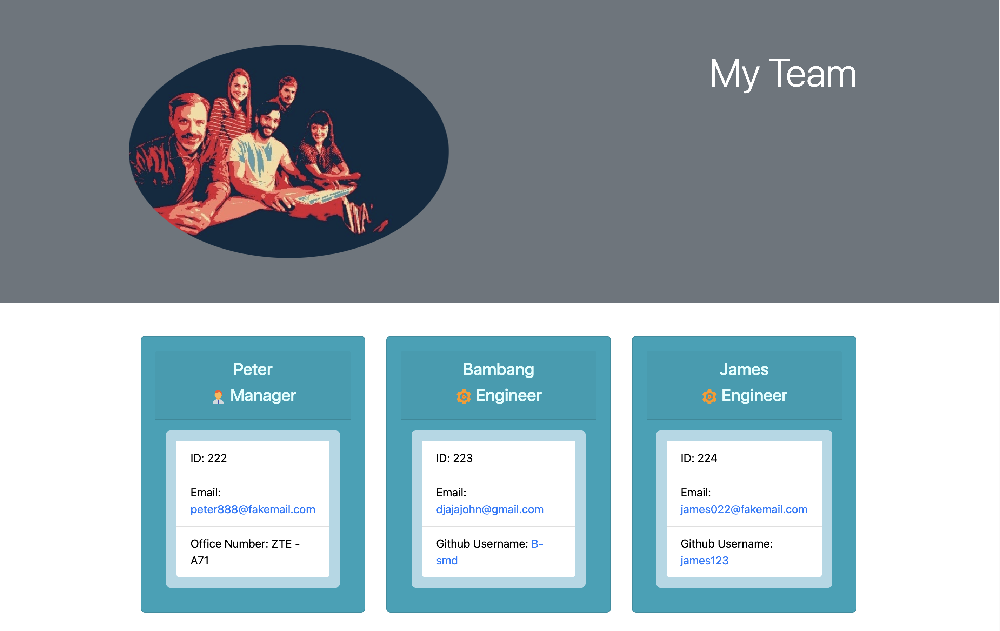

# Team-Profile-Generator
  

## Description
The Team profile Generator is a Node.js command-line input application that requests information from the user about employees on a software engineering team and generates an HTML file displaying summaries for each person. To make the code maintainable when I was created `Employee.js`, `Engineer.js`, `Intern.js`, `Manager.js`, also I was created `Employee.test.js`, `Engineer.test.js`, `Intern.test.js` and `Manager.test.js`, I did jest tests each classes with `npm run test` and passed.
I was installed `npm i @types/jest` and on the `package.json` under devDependencies I was typing `@types/jest:"^27.4.1"`, so I can get auto test each time, when I was creating the code. The first class is an `Employee` parent class with the following properties and methods: `name`, `id`, `email`, `getName()`, `getId()`, `getEmail()` and `getRole()`&mdash; return `"Employee"`. The other three classes `Manager`, `Engineer`and `Intern` will extend `Employee`, in addition to `Employee`'s properties and methods. `Manager` will also have the following: `officeNumber`, `getRole()`&mdash;overridden to return `Manager`. `Engineer` will also have the following: `github`&mdash;Github username, `getGithub()`, `getRole()`&mdash;overridden to return `Engineer`. `Intern` will also have the following: `school`, `getSchool()`, `getRole()`&mdash;overeidden to return `Intern`. To generate an HTML, I use `Bootstrap 4` is an open-source front-end framework.

## Table of Contents (Optional)
- [Installation](#installation)
- [Usage](#usage)
- [Credits](#credits)
- [License](#license)
- [Badge](#badge)
- [Features](#features)
- [Contributing](#contributing)
- [Tests](#tests)
- [Questions](#questions)

## Installation
Create `.gitignore` and include `node_modules`, then Install `npm` to acquire inquirer package. Install `npm i -D jest` and `npm i @types/jest` to test your code with auto test with `jest`

## Usage
Open terminal, then type `node index.js` and entered, then answer the prompts that follow, finally when you choose `Finished building my team`, a Team profile will be generated.

## Demo

https://drive.google.com/file/d/1pMg7k28zOz_OIfNU3dyHR8VYFDrN5Sx6/view

## Credits
- https://github.com/Simon-Xu-Lan

## License
    This application is covered by the MIT license.

---
## Badge

## Features
n/a

## Contributing
Pull request are welcome, you can make a constribution at the bottom of any docs page to make small changes such as a typo, sentence fix or a broken link. For major changes, please open an issue first to discuss what you would like to change.

## Tests
Answer all questions in the terminal until you choose `Finished building my team` and it will generated a Team Profile

## Questions

If you have any question, Email me at: djaja@iinet.net.au 

Find me on GitHub: [B-smd](https://github.com/B-smd)   
